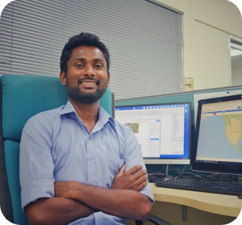

# About me
{ align=right }
I am presently working as a **Research Associate** at Geoinformatics Center, **Asian Institute of Technology(AIT)**, Thailand. My current work in AIT includes utilizing geospatial technologies to address real-world issues caused by natural disasters and environmental changes.
Project management for International Disaster Charter and emergency mapping for disaster response for the Sentinel Asia initiative are my key responsibilities. Furthermore, I perform Remote Sensing and GIS analysis for land cover mapping, forestry applications, and air quality monitoring applications. I am also involved in drone-based mapping and data processing for real-world applications.